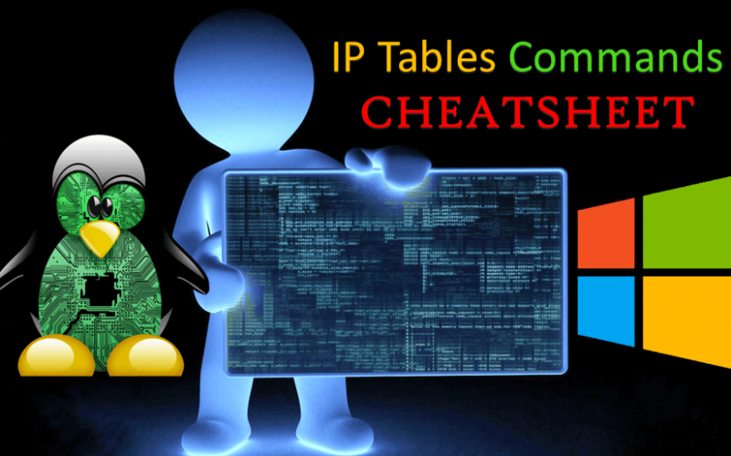

# IPtables Commands Cheatsheet

<figure><figcaption><p>IPtables Commands Cheatsheet</p></figcaption></figure>

IPtables là một chương trình tiện ích không gian người dùng cho phép quản trị viên hệ thống định cấu hình các bảng do tường lửa nhân Linux cung cấp (được triển khai dưới dạng các mô-đun Netfilter khác nhau) cũng như các chuỗi và quy tắc mà nó lưu trữ. Vì iptables yêu cầu các đặc quyền nâng cao để hoạt động nên nó phải được thực thi bởi người dùng root, nếu không nó sẽ không hoạt động.

Các chương trình và mô-đun hạt nhân khác nhau hiện đang được sử dụng cho các giao thức khác nhau: iptables áp dụng cho IPv4, ip6tables cho IPv6, arptables cho ARP và ebtables cho các khung Ethernet.

Trên hầu hết các hệ thống Linux, iptables được cài đặt là **/sbin/iptables** . Cú pháp chi tiết của lệnh iptables được ghi lại trong trang man của nó, có thể hiển thị bằng cách gõ lệnh “ **man iptables** “.

**Drop All Outgoing to Facebook Networks**

Get Facebook AS:

```
whois -h v4.whois.cymru.com " -v $(host facebook.com | grep "has address" | cut -d " " -f4)" | tail -n1 | awk '{print $1}'
```

Drop:

```
for i in $(whois -h whois.radb.net -- '-i origin AS32934' | grep "^route:" | cut -d ":" -f2 | sed -e 's/^[ \t]*//' | sort -n -t . -k 1,1 -k 2,2 -k 3,3 -k 4,4 | cut -d ":" -f2 | sed 's/$/;/') ; do

iptables -A OUTPUT -s "$i" -j REJECT

done
```

**Log and Drop Packets**

```
iptables -A INPUT -i eth1 -s 10.0.0.0/8 -j LOG –log-prefix “IP_SPOOF A: ”
iptables -A INPUT -i eth1 -s 10.0.0.0/8 -j DROP
```

**By default everything is logged to /var/log/messages file**

```
tail -f /var/log/messages
grep --color 'IP SPOOF' /var/log/messages
```

```
https://hackersonlineclub.com/iptables-commands-cheatsheet-for-windows-and-linux
```
