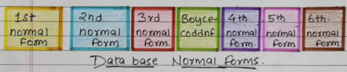

# SQL Interview Q/A

## Các loại kỹ thuật chuẩn hóa dữ liệu

\<?> Có những loại chuẩn hóa cơ sở dữ liệu nào?

\=> Chuẩn hóa cơ sở dữ liệu có thể dễ dàng hiểu được với sự trợ giúp của một nghiên cứu điển hình. Các hình thức bình thường có thể được **chia thành 6 hình thức** và chúng được giải thích bên dưới"

<figure><figcaption><p>Type of Normalization Techniques</p></figcaption></figure>

Xem thêm:\
\- Clip giảng: [https://youtu.be/utinjhGpFzU](https://youtu.be/utinjhGpFzU)\
\- https://www.analyticsvidhya.com/blog/2022/07/different-types-of-normalization-techniques/\
\- https://beginnersbook.com/2015/05/normalization-in-dbms

## Sử dụng hàm UPPER và LOWER

\<?> Viết truy vấn sql để viết hoa tên nhân viên và viết thường tên thành phố

\=> Chúng ta có thể sử dụng chức năng **UPPER** và **LOWER** để đạt được kết quả mong muốn

```
SELECT UPPER(FullName), LOWER(City) FROM EmployeeDetail
```

## Sử dụng LTRIM và RTRIM

\<?> Viết truy vấn sql để cập nhật tên nhân viên bằng cách xóa khoảng trắng ở đầu và cuối

\=> Chúng ta có thể sử dụng chức năng **LTRIM** và **RTRIM** để đạt được kết quả mong muốn

```
UPDATE EmployeeDetail SET FullName = LTRIM(RTRIM(FullName))
```

## Sử dụng hàm REPLACE

\<?> Viết truy vấn sql để lấy tên đầy đủ của nhân viên và thay thế khoảng trắng bằng '-'

\=> Chúng ta có thể sử dụng chức năng **REPLACE** để đạt được kết quả mong muốn

```
SELECT REPLACE(FullName, '', '-') FROM EmployeeDetail;
```

## Tham khảo

* MLTut (https://www.facebook.com/groups/315272545240115/)
