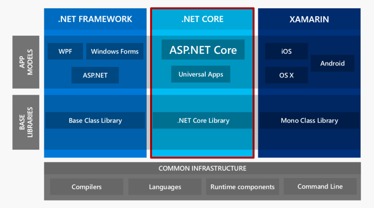

# Phân biệt .NET Framework, .NET Core và Mono

Một trong những điểm mạnh của hệ sinh thái .NET là sự hỗ trợ rất tốt của các công cụ như Visual Studio. Tuy nhiên đây cũng là điểm yếu vì nó ngăn cản rất nhiều lập trình viên tiếp xúc với những lý thuyết căn bản của Framework. Trong bài viết này chúng ta sẽ tìm hiểu xem .NET là gì, và các nền tảng .NET Framework, .NET core, và Mono khác nhau như thế nào.

Đối với những người mới làm quen với .NET hay kể cả một số người đã làm việc với .NET lâu năm, những cái tên như .NET Framework, Mono hay gần đây nhất là .NET core vẫn hay gây ra những hiểu nhầm.\
Tuy nhiên, khi căn cứ vào các [khái niệm căn bản về .NET](./#vay-khai-niem-can-ban-ve-.net-la-gi) thì chúng ta sẽ phân biệt được các phiên bản một cách dễ dàng.\
Về cơ bản, .NET Framework, .NET core và Mono là ba phiên bản .NET khác nhau (có nghĩa là mỗi phiên bản có **Runtime**, **Libraries** và **Toolings** riêng).

## Vậy tại sao lại có đến 3 phiên bản khác nhau?

* [**.NET Framework**](.net-framework.md) được Microsoft đưa ra chính thức từ năm 2002. .NET Framework chỉ hoạt động trên Windows. Những nền tảng ứng dụng như _WPF_, _Winforms_, _ASP.NET(1-4_) hoạt động dựa trên .NET Framework.
* [**Mono**](mono.md) là phiên bản cộng đồng nhằm mang .NET đến những nền tảng ngoài Windows. Mono được phát triển chủ yếu nhằm xây dựng những ứng dụng với giao diện người dùng và được sử dụng rất rộng rãi: _Unity Game_, _Xamarin_…
* [**.NET Core**](.net-core.md) được Microsoft thai nghén kể từ năm 2013 định hướng ứng dụng đa nền tảng. .NET core hiện được sử dụng trong các ứng dụng _Universal Windows platform_ và _ASP.NET Core_.

<figure><figcaption></figcaption></figure>

## Vậy tôi nên sử dụng .NET Framework, .NET Core hay Mono?

Tùy thuộc vào nhu cầu, mục đích sử dụng của ứng dụng mà bạn định phát triển.\
\
Đối với các ứng dụng Windows desktop, .NET Framework sẽ là sự lựa chọn của bạn.\
Nếu bạn phát triển game dựa trên Unity, hay những ứng dụng di động với Xamarin, bạn sẽ sử dụng Mono.\
Đối với các Web server, bạn có thể sử dụng cả .NET Framework và .NET Core.


Tuyệt đối không nên dùng Mono để vận hành web server. Bộ máy dọn rác của Mono không được thiết kế để hoạt động với webserver và sẽ gây ra quá tải nhanh chóng.

Vậy nên lựa chọn .NET Framework hay .NET Core cho các web server? .NET Core chạy được đa nền tảng và có hiệu năng cao hơn. Nhược điểm duy nhất của nó là số lượng thư viện hỗ trợ vẫn còn hạn chế. .NET Framework có hệ sinh thái lớn hơn với nhiều các thư viện hỗ trợ hơn.


## Vậy khái niệm căn bản về .NET là gì?

Rất nhiều những người đã làm việc với .NET lâu năm nhưng vẫn mù mờ về những khái niệm, định nghĩa của Framework. Điều này rất nguy hiểm vì nó gây ra việc hiểu sai về nền tảng, dẫn đến việc sản sinh ra những phần mềm chất lượng không cao. Do đó hiểu rõ về framework của mình là trách nhiệm của bất cứ lập trình viên nào?

### Khi nói về .NET, người ta thường hàm ý 3 thành phần:

* [**Runtime**](./#runtime-moi-truong-hoat-dong) (môi trường hoạt động)
* [**Libraries**](./#libraries-thu-vien) (thư viện)
* [**Toolings**](./#toolings-cong-cu-phat-trien) (công cụ phát triển).

Chúng ta sẽ lần lượt tìm hiểu những thành phần ở phần sau của bài viết.

### Làm sao .NET chạy được đoạn code CSharp (C#)

Để hiểu làm được làm sao đoạn code C#, VB hay F# chạy được thì chúng ta cần nắm rõ quy trình biên soạn trong .NET

<figure><figcaption></figcaption></figure>

Trong hình trên, phần "Compile time" là quá trình "Build", và "Runtime" là quá trình chạy (tức là tính từ khi bạn khởi động ứng dụng của mình).

### Runtime (môi trường hoạt động)

Về cơ bản, khi bạn thực hiện lệnh build (trong Visual Studio, hay ‘dotnet build’ bằng dòng lệnh) thì source code của bạn được chuyển hóa thành một dạng ngôn ngữ trung gian có tên là MSIL (Microsoft Intermediate Language). Khi ứng dụng được khởi chạy, thành phần Runtime-hay tên gọi riêng biệt trong .NET là CLR(common language runtime) sẽ tiến hành dịch mã MSIL thành mã máy(Native code) để cho máy tính có thể thực thi. Quá trình này gọi là JIT (just-in-time) compilation. Cách biên soạn và vận hành của .NET khá giống với Java.

Ngoài việc biên dịch, môi trường hoạt động (Runtime) còn có những công dụng như:

* Tự động quản lý bộ nhớ. Khi làm việc với những ngôn ngữ bậc cao như C# hay Java, bạn không cần giải phóng bộ nhớ bằng cách gọi free() như khi làm việc với C/C++. CLR bao gồm một công cụ dọn rác (Garbage collector -GC) sẽ tự động giải phóng những phần bộ nhớ không được sử dụng
* Strong typings: CLR quản lý thông tin về các kiểu dữ liệu mà bạn sử dụng. Điều này giúp cho bạn có thể phân biệt được các định dạng thông tin của từng biến khác nhau (class, structure…)

### **Libraries** (thư viện)

Khi bạn làm việc với .NET, code của bạn sẽ tương tác với rất nhiều các class khác nhau. Ví dụ: Class được sử dụng nhiều nhất trong .NET là _System.String_. Tất cả những class này được định nghĩa trong hệ thống thư viện cơ bản của .NET mà người ta hay gọi tắt là **BCL** (Base class libraries).


Mã nguồn của **BCL**, trái với mọi người hay nghĩ, là mã nguồn mở. Bạn có thể truy cập mã nguồn này tại _sourceof.net_.


### **Toolings** (công cụ phát triển)

Các công cụ (toolings) của .NET bao gồm compiler và Visual Studio .NET sử dụng hệ thống build của Microsoft gọi là _**MSBuild**_. Đối với nền tảng .NET Core mới thì chúng ta còn có thêm công cụ dòng lệnh (_**dotnet cli**_).

## Nguồn tham khảo

* https://www.tma.vn/Hoi-dap/Cam-nang-nghe-nghiep/NET-core-vs-ASP-NET-core-Phan-biet-NET-Framework-NET-Core-va-Mono/16707
