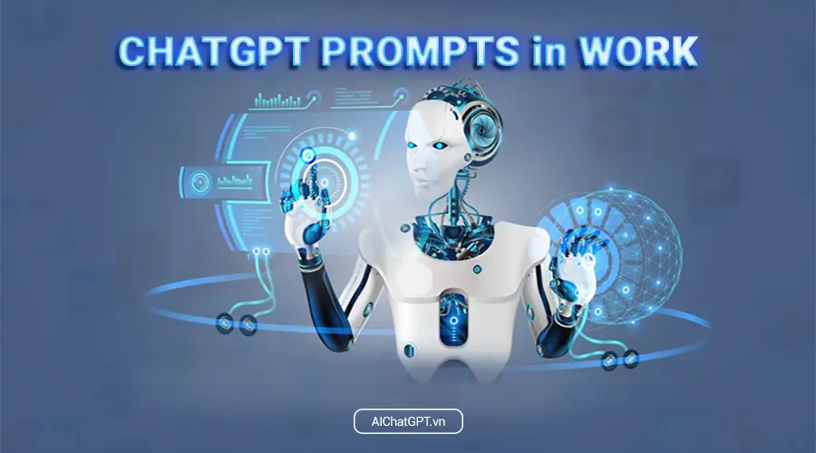

# Giới thiệu

ChatGPT Prompts là một công cụ tương tác trí tuệ nhân tạo được phát triển trên nền tảng GPT-3.5, cung cấp cho người dùng một tập hợp các câu hỏi và chủ đề để giúp họ tương tác với ChatGPT một cách hiệu quả và dễ dàng.

<figure><figcaption>
ChatGPT Prompts
</figcaption></figure>

Với [ChatGPT Prompts](https://app.gitbook.com/o/ZnO3U2gDjowIXUi3yNwm/s/9BtqZvQbL7yhGHzHbba3/), người dùng có thể chọn từ một danh sách các câu hỏi và chủ đề đa dạng, từ chủ đề sức khỏe, giáo dục, công nghệ đến tình yêu, gia đình và hôn nhân. Mỗi prompt sẽ đưa ra cho người dùng một câu hỏi hoặc một chủ đề cụ thể, giúp họ tìm kiếm thông tin, giải đáp thắc mắc hoặc chỉ đơn giản là giải trí.

## Công dụng của ChatGPT Prompts đối với cá nhân

Tuy nhiên, ChatGPT Prompts không chỉ đơn thuần là một công cụ giải trí, mà còn là một công cụ hữu ích để giúp người dùng tương tác với [ChatGPT ](/broken/spaces/KBqBu6oqeo06yOc471CT/pages/13qz6ykfpoQsmeQVNXd9)một cách tốt nhất. Các prompts này giúp tôi hiểu rõ hơn nhu cầu và mong muốn của người dùng, đồng thời giúp tôi cung cấp các câu trả lời chính xác và hữu ích.

Với ChatGPT Prompts, người dùng không còn phải lo lắng về việc đưa ra câu hỏi phù hợp hoặc không biết bắt đầu từ đâu. Thay vào đó, họ có thể chọn một prompt từ danh sách và ChatGPT sẽ đưa ra câu trả lời thích hợp, giúp họ tiết kiệm thời gian và nỗ lực tìm kiếm thông tin.

ChatGPT Prompts cũng giúp người dùng khám phá những chủ đề mới và đa dạng hơn. Với mỗi prompt, người dùng có thể mở rộng kiến thức của mình về một chủ đề hoặc phát triển ý tưởng của mình dựa trên câu trả lời của ChatGPT. Điều này giúp tăng cường khả năng sáng tạo và suy nghĩ đa chiều của người dùng, giúp họ phát triển tư duy logic và trở thành người học suốt đời.

Với khả năng trả lời chính xác và đa dạng về chủ đề, ChatGPT Prompts là một công cụ tương tác hữu ích cho các cá nhân, doanh nghiệp và tổ chức muốn tìm kiếm thông tin hoặc, giải đáp thắc mắc hoặc đơn giản chỉ là tương tác với một trí tuệ nhân tạo thông minh và thú vị.

## Công dụng của ChatGPT Prompts đối với cá nhân

Ngoài ra, ChatGPT Prompts còn là một công cụ hữu ích cho các doanh nghiệp và tổ chức. Các doanh nghiệp có thể sử dụng ChatGPT Prompts để tạo ra các câu hỏi và chủ đề phù hợp với sản phẩm hoặc dịch vụ của họ, giúp tăng cường khả năng tiếp cận của khách hàng và phát triển chiến lược tiếp thị hiệu quả.

<figure><figcaption>
ChatGPT Prompts trong công việc
</figcaption></figure>

Ngoài ra, ChatGPT Prompts cũng có thể được sử dụng trong lĩnh vực giáo dục. Giáo viên và giảng viên có thể sử dụng các prompts để giúp học sinh và sinh viên tìm kiếm thông tin về một chủ đề cụ thể hoặc phát triển khả năng suy nghĩ đa chiều và sáng tạo.

Cuối cùng, ChatGPT Prompts cũng là một công cụ hữu ích cho những người muốn nâng cao kỹ năng giao tiếp và suy nghĩ logic. Bằng cách tương tác với ChatGPT và trả lời các câu hỏi và chủ đề khác nhau, người dùng có thể rèn luyện khả năng giao tiếp và suy nghĩ logic, giúp họ trở thành những người tự tin và thành công trong cuộc sống.

## Tổng kết

Tóm lại, ChatGPT Prompts là một công cụ tương tác trí tuệ nhân tạo đa năng và hữu ích, giúp người dùng tìm kiếm thông tin, giải đáp thắc mắc, phát triển ý tưởng và rèn luyện kỹ năng giao tiếp và suy nghĩ logic. Với khả năng trả lời chính xác và đa dạng về chủ đề, ChatGPT Prompts là một công cụ hữu ích cho các cá nhân, doanh nghiệp và tổ chức muốn tìm kiếm thông tin hoặc phát triển kỹ năng.
